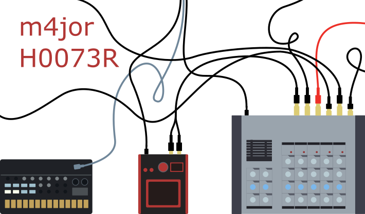

# Hoot Graphics

These are a set of SVG images made to represent the instruments in [tableh00t3rs](http://cyberboy666.com/tablehooters/), which was a musical project brought into being by cyberboy666 & user43368831.

The graphics are a simple, minimal and flat design meant to represent the character of the instruments, rather than the exact detail.

Future improvements to this work would include more of the instruments, and potential algorithmic generation of instruments that are yet to exist.
